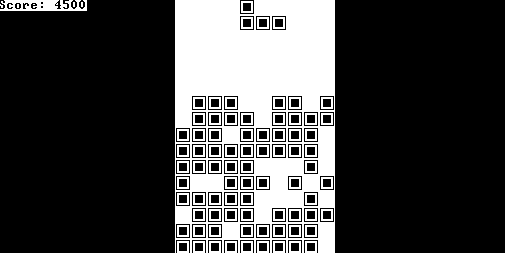

# nand2tetris

Contains projects from [nand2tetris](https://www.nand2tetris.org).

## Tetris Game



Simple tetris game using bitmap graphics.
Each cleared lined is 100 points.
Stacking tetrominos off screen ends the game.
Basic collision detection to handle most situations.
Needs better control response atm.

### Controls

* Left Arrow = Move tetromino left
* Right Arrow = Move tetromino right
* Z Key = Rotate tetromino counter clockwise
* X Key = Rotate tetromino clockwise
* Space Bar = Move tetromino down faster
* R Key = Restart tetris game
* Q Key = Quit tetris game

### Build and Emulate

Tetris can be built with the command:

```
./build.sh
```

The tetris game can be emulated with the VMEmulator provided under tools.
After build, load all vm files in tetris/out/ into the VMEmulator, set to No Animation and Screen, and hit the Run button.

## Assembler

Converts an assembly language into instruction sets for the cpu.
Assembler takes as input 1 asm file and outputs 1 hack file with the same name.

```
./assembler.py <asm file>
```

## VM Translator

Translates the intermediate vm language into assembly.
VM translator takes as input either 1 vm file or a directory containing multiple vm files.
Outputs 1 asm file.

```
./vm_translator.py <vm file|vm directory>
```

## Compiler

Compiles the high level jack language into the vm language.
Outputs 2 files to the out directory.
First file is an xml file showing tokens and program structure.
Second file is the compiled vm file.

```
./compiler.py <jack file|jack directory>
```

### Analyzer

The analyzer outputs the tokens generated by the tokenizer.
Out filename is "out/[Name]T.xml" where [Name] is the original filename.

```
./analyzer.py <jack file|jack directory>
```

## TODOs

* .sh files for building tetris (compiler -> vm translator -> assembler -> cpu instruction set)
